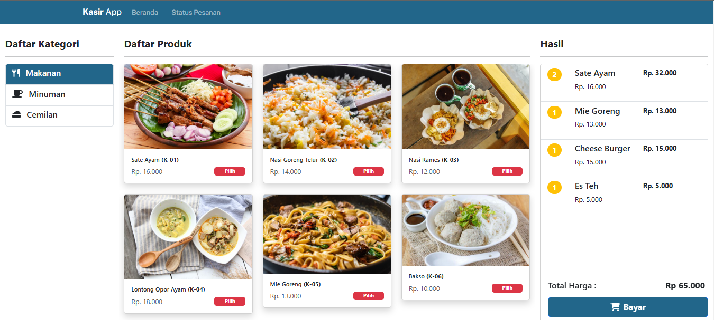

# Kasir App

Kasir App adalah aplikasi kasir sederhana yang dibangun dengan React.js di bagian frontend dan JSON Server sebagai mock API untuk kebutuhan data. Aplikasi ini cocok banget buat simulasi transaksi penjualan di toko kecil atau warung. Selain itu, bisa jadi proyek latihan atau demo buat belajar React dan cara ngubungin frontend sama JSON Server.

## Screenshot Aplikasi



## Sumber Belajar

Aplikasi ini dibangun dengan mengikuti tutorial dari YouTube Wahidev Academy. Kalian bisa cek video tutorial lengkapnya [di sini](https://www.youtube.com/@WahidevAcademy).
Terima kasih kepada Wahidev Academy atas tutorialnya yang sangat membantu!

## Fitur

- **Tampilan Produk**: Menampilkan daftar produk yang tersedia, lengkap dengan kategori dan harga. Jadi, kamu bisa liat apa aja yang dijual di toko.
- **Keranjang Belanja**: Bisa nambahin produk ke keranjang, hitung total harga, dan ngatur item dalam keranjang. Jadi, mudah banget buat cek total belanjaan.
- **Total Pembayaran**: Menampilkan total harga dari semua item yang ada di keranjang secara dinamis. Gak bakal bingung lagi berapa total belanjaan kamu.
- **Transaksi Sukses**: Setelah transaksi berhasil, aplikasi bakal kasih pesan sukses. Jadi, kamu tau kalau transaksi udah selesai dengan baik.

## Teknologi yang Digunakan

- **Frontend**: React.js dengan Vite
- **Backend**: JSON Server (sebagai mock API yang ngambil data dari file JSON)
- **Styling**: React-Bootstrap

## Cara Install dan Jalankan

1. Clone repository ini ke komputer kamu:

   ```bash
   git clone https://github.com/username/kasir-app.git
   ```

2. Install dependencies:

   ```bash
   npm install
   ```

3. Jalankan JSON Server untuk menyediakan data:

   ```bash
   npx json-server db.json
   ```

4. Jalankan aplikasi React dengan Vite:

   ```bash
   npm run dev
   ```

5. Akses aplikasi di browser:
   ```bash
   http://localhost:5173
   ```

## Dokumentasi JSON Server

Untuk dokumentasi lebih lanjut mengenai JSON Server, kamu bisa kunjungi situs resmi JSON Server di [sini](https://github.com/typicode/json-server/tree/v0).

